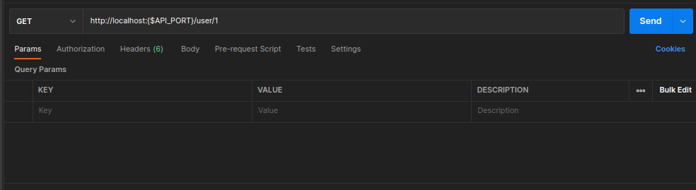

# TOTALITY CORP ASSIGNMENT 

## Introduction

Microservie created by using GO and gRPC. 

This project consits of a gRPC service and an API gateway.

Follow the given steps to run and test assignment.

### Installation

  #### 1. Clone the repository:

  ```bash
    git clone https://github.com/akshayUr04/golang-assignment-totalitycorp.git && \
    cd ./golang-assignment-totalitycorp
  ```

 ### 1. API Gateway
  ##### 1. Install dependencies
  ```bash
    ## Assuming you are in root of the project
    cd ./apigateway && \
    go mod tidy
  ```

  ##### 2. Setup Env
  create a .env file and add the below values
  ```bash
    ## check the .env.example
    PORT = "port that you need to run the api gateway"
    USERSVCPORT = "port that the server is running"
  ```

  ##### 3. Run Application
  ```bash
    go run ./cmd/api
    or 
    make server
  ```

### 2. Server
  ##### 1. Install dependencies
  ```bash
    ## Assuming you are in root of the project
    cd ./totalitycorp-service && \
    go mod tidy
  ```
  ##### 2. Setup Env
  create a .env file and add the below values
  ```bash
    ## check the .env.example
    PORT = "port that you need to run the server"
  ```

  ##### 3. Run Application
  ```bash
    go run ./cmd/api
    or 
    make server
  ```

### Run Application using Docker
  ```bash
     ## Assuming you are in root of the project
    docker compose up
  ```
### Test Application using Postman
   ##### 1.Get By ID
   
   ##### 1.Get By Multiple IDs
   

### Run Unit Test
   ```bash
     cd ./totalitycorp-service/pkg/service
     go test
  ```